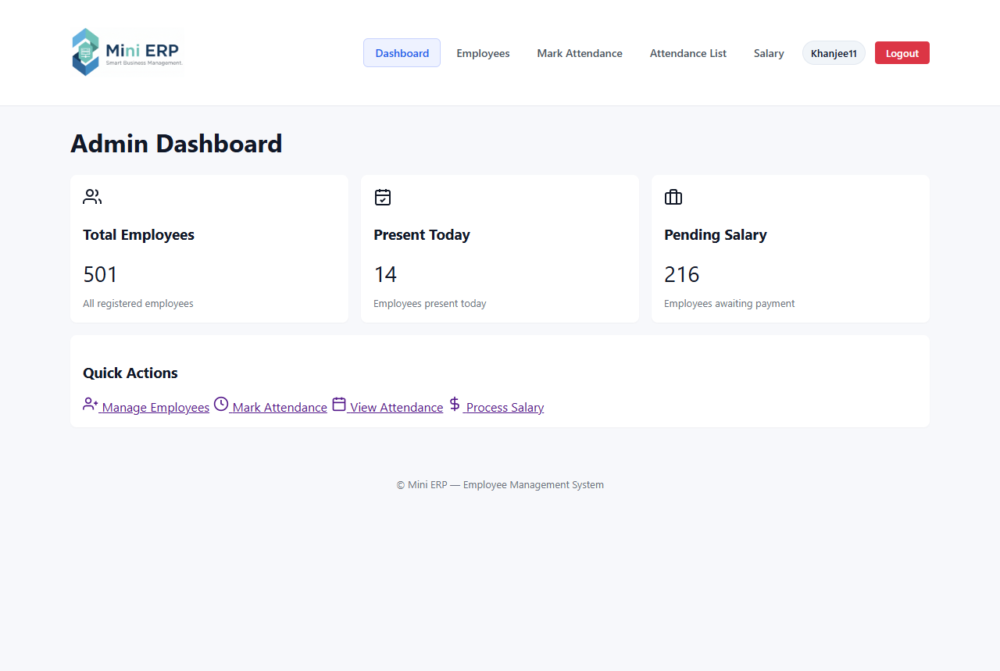
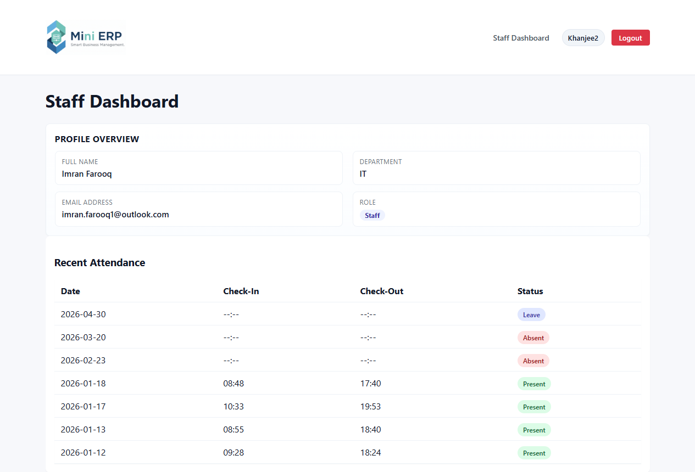
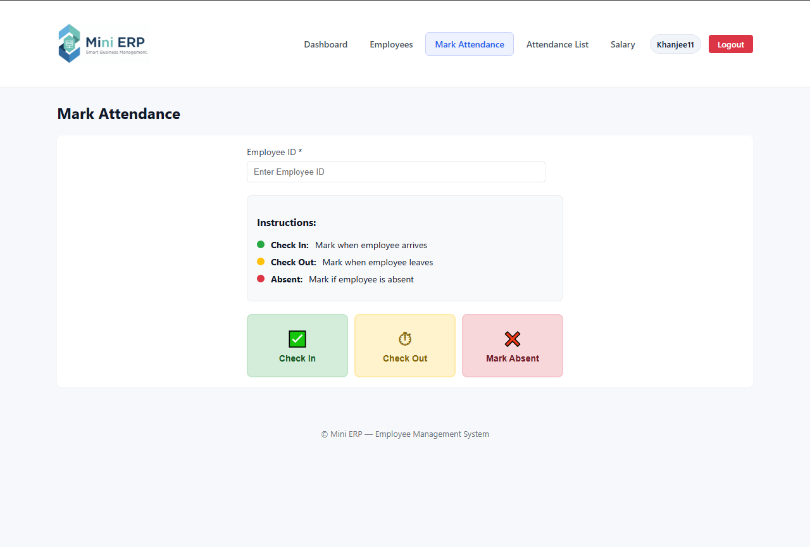
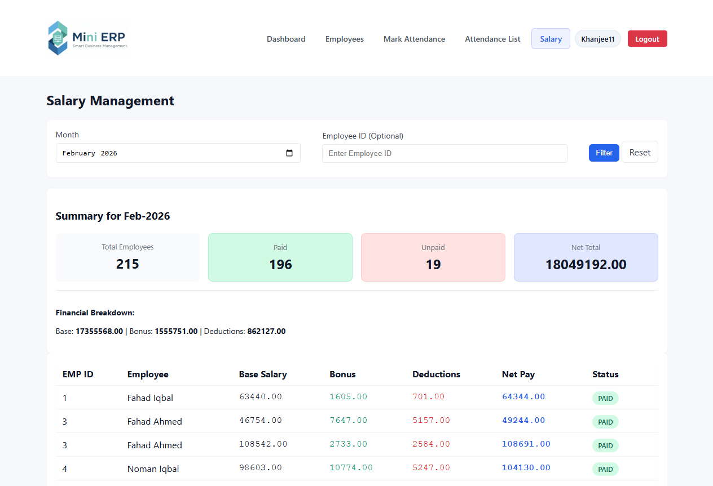

# Mini ERP (Flask)

A lightweight HR/ERP web application built with Flask and MySQL.  
It provides role-based access for Admin and Staff to manage employees, attendance, and salaries.

## Features
- User authentication (login, register, logout)
- Role-based access control (Admin, Staff)
- Employee management (CRUD, search, filters, pagination)
- Attendance system (check-in, check-out, absent)
- Daily attendance overview (admin)
- Monthly attendance summary (employee)
- Salary management (monthly view, net calculation, paid/unpaid tracking)
- Admin and Staff dashboards

## Tech Stack
- Python (Flask)
- MySQL (PyMySQL)
- Werkzeug (password hashing)
- HTML/CSS (Jinja templates)

## Project Structure
```
C:.
|   .env
|   .gitignore
|   app.py
|   config.example.py
|   config.py
|   mineerp.sql
|
|---static
|   |---css
|   |       style.css
|   |
|   |---js
|           app.js
|
|---templates
|   |   base.html
|   |
|   |---admin
|   |       attendance.html
|   |       dashboard.html
|   |       employees.html
|   |       employee_form.html
|   |       salary.html
|   |
|   |---attendance
|   |       attendance.html
|   |
|   |---auth
|   |       login.html
|   |       register.html
|   |
|   |---staff
|           dashboard.html
```

## Installation & Setup
1. Clone the repository
2. Create and activate a virtual environment
3. Install core dependencies:
   - Flask
   - PyMySQL
   - Werkzeug

### Setup Commands (Windows PowerShell)
```powershell
python -m venv venv
.\venv\Scripts\Activate.ps1
pip install Flask PyMySQL Werkzeug
```

## Environment Setup (.env)
Yes - create a `.env` file in the project root.  
You can copy it from `config.example.py` / `.env.example` style:

```
SECRET_KEY=replace-me
DB_HOST=localhost
DB_PORT=3306
DB_NAME=mini_erp
DB_USER=root
DB_PASSWORD=your_password_here
```

## Database Setup
A SQL file is provided: `mineerp.sql`

Steps:
1. Create a new MySQL database (example: `mini_erp`)
2. Import the SQL file to create all required tables
   - `mineerp.sql`

### Example Import Command (MySQL)
```bash
mysql -u root -p mini_erp < mineerp.sql
```

## Authentication & Role-Based Access
- Session-based authentication
- Passwords are stored using secure hashing (Werkzeug)
- Two roles:
  - **Admin**: full access to dashboards and management modules
  - **Staff**: personal dashboard and attendance view

## Admin Panel Modules
- Dashboard (employees count, attendance, unpaid salaries)
- Employee Management (CRUD, filters, pagination)
- Attendance Management (daily + monthly summaries)
- Salary Management (monthly view, paid/unpaid status, net calculation)

## Staff Panel Modules
- Profile overview
- Recent attendance records

## Demo Credentials (Local Testing Only)
**Admin Login**
- emp_id: 11
- password: khanjee11

**Staff Login**
- emp_id: 2
- password: khanjee2

> Security Note: Change demo credentials before deploying to production.

## How to Run the Project
1. Activate your virtual environment
2. Start the Flask app:

```bash
python app.py
```

## Screenshots
Screenshots are stored in `static/`:
- Admin Dashboard  
  
- Staff Dashboard  
  
- Mark Attendance  
  
- Salary  
  

## Recent Updates
- Added active tab highlighting in the navbar for both admin and staff views.
- Updated staff profile card and username styling for a more professional UI.
- Logo is now loaded from `static/` and favicon set is configured in the base template.
- `.env` loader added in `config.py` to support local environment variables.

## Future Improvements
- Add CSV export for salary and attendance
- Add password reset
- Add email notifications
- Improve UI/UX responsiveness

## License
MIT
